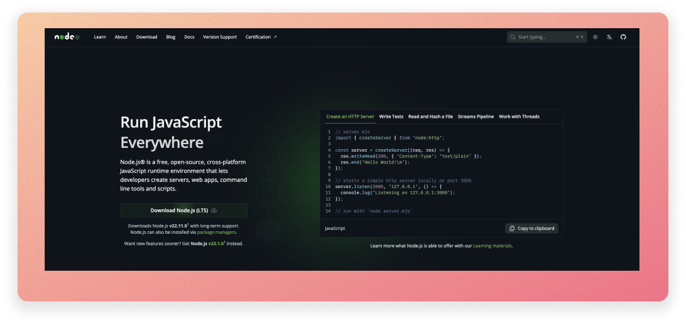

# Install Node.js



To make React and other JavaScript libraries work, you need to install Node.js. Luckily, it's easy to install Node.js on any operating system.

## On your own computer

1. If you are using your own computer: download the installer from the [official website](https://nodejs.org/en/). It is a simple installer that will install Node.js and npm (Node Package Manager) on your computer.

2. Run the installer. You can use the default settings.

3. To check if Node.js is installed, open a terminal and type `node -v`. You should see the version of Node.js you have installed. You should see something like this:

```bash
$ node -v
v23.1.0
```

## On the lab computers

If you use a Linux lab computer, you won't be able to run binary installers. [Instead, you can use the Node Version Manager (nvm) to install Node.js](https://github.com/nvm-sh/nvm). NVM is a script that allows you to manage multiple versions of Node.js on the same computer. We will use nvm to install Node.js version 22.11.0, the version of Node.js. However, in reality, you can install any version of Node.js using nvm - this is useful if you are working on a project that requires a specific version of Node.js.

1. To install NVM, open a terminal and run the following commands:

```bash
wget -qO- https://raw.githubusercontent.com/nvm-sh/nvm/v0.40.1/install.sh | bash
source ~/.bashrc
```

> > This will download and run the nvm installation script. The second command will update your terminal configuration so that nvm is available in your terminal.

2. We now have NVM; however, no version of node installed! To install Node.js version 22.11.0, run the following command:

```bash
nvm install 22.11.0
```

3. To check if Node.js is installed, type `node -v`. You should see the version of Node.js you have installed. You should see something like this:

```bash
$ node -v
v22.11.0
```
