---
title: "Creating a Full Stack Application: Lab"
author: [Joe Appleton]
date: "22-11-2023"
subject: "Lab"
keywords: [Lab]
lang: "en"
toc: true
colorlinks: true
toc-own-page: false
listings-disable-line-numbers: true
...

# Lab 10: Creating a Full Stack Application

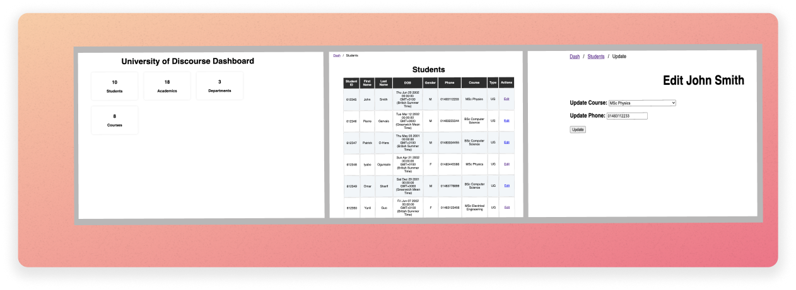

> > This is what we are making in this lab!

In this lab, you'll combine everything you've learned so far. In doing so, we are going to make a full-stack web application. By the end of this session, you'll add a web front-end to our university of discourse database. You'll be able to display a list of students and update the course they are on.

You should note, some of you won't finish this lab in the session. That's ok. You'll have plenty of time to finish the application in your own time. Following this lab, I'll release a video that will walk you through the solution.

If you get stuck, don't forget to ask for help.

## Dependencies

**Ensure the Node Environment path is set on your VM, and you have installed VS code (see, the week 8 lab, "exercise 0.1 : Leveling up our Development Environment".** If you are working along from home, you won't need to set the path; however, you will need to install VSCode (see, https://code.visualstudio.com/download) and NodeJS (see, https://nodejs.org/en ) .

## 0.0 Getting Started

In this part of the lab, we'll get set up and get the starter code.

### Exercise 0.1 : Getting Started

1. As always, start and connect to your Azure Labs' virtual machine (VM) by visiting this link: [https://labs.azure.com/virtualmachines](https://labs.azure.com/virtualmachines).
1. Connect to the VM:
   1. Toggle the button to start – it might take a while.
   2. Once it changes to Running, click on the monitor icon.
   3. A file will be downloaded – click on it to run it, and you will be prompted to enter the password you created last time. IMPORTANT: the username must be `labuser` (remove the ~/).
   4. Remember to click on the following icon to make the window resize appropriately 
1. Within your VM, create a folder in your `C:\code` directory called `lab_10`.

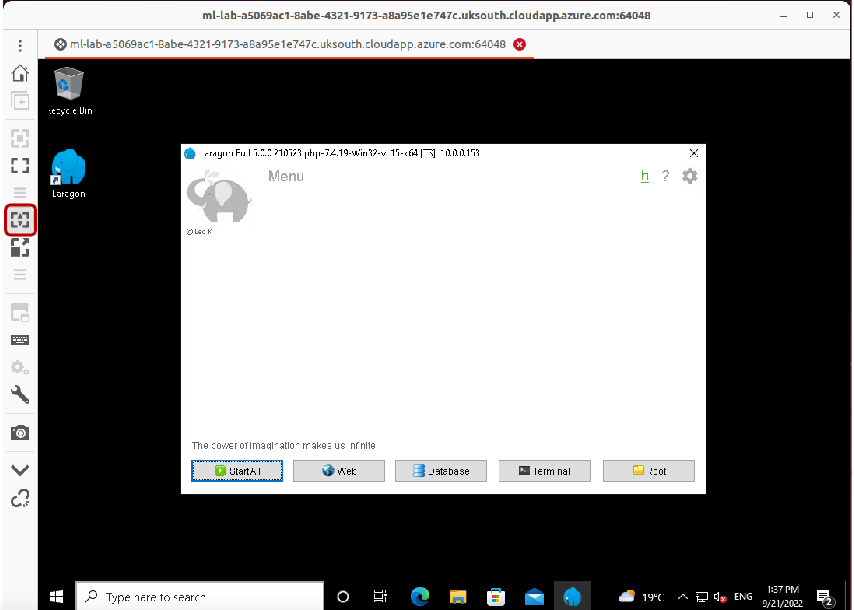

4. Open Laragon and start all services.
5. Open VS Code and open the `lab_10` folder.

### Exercise 0.2: Getting the starter code

This week, I've provided you with some starter code. We'll use git to get this code. Git is installed with Laragon, so we can use the Laragon terminal to get the code. If you are working from home, you'll need to install git (see, https://git-scm.com/downloads).

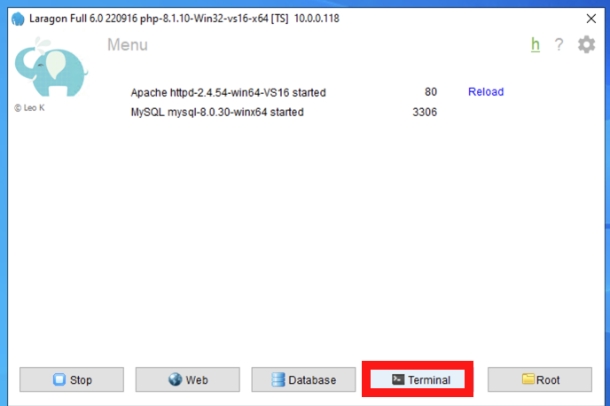

1. Within your VM, open the Laragon terminal.
2. Navigate to the `lab_10` folder you created earlier: `cd C:\code\lab_10`, and run the following command (**don't forget the `.` at the end, this tells git to clone the code into the current directory**):

   `git clone https://github.com/joeappleton18/w-d-l-10.git .`

> > This will clone the starter code into your lab_10 folder.

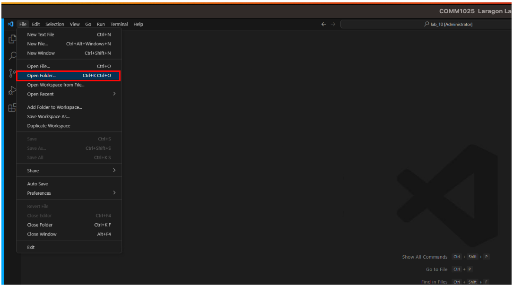

3. Open the `lab_10` folder in VS Code.

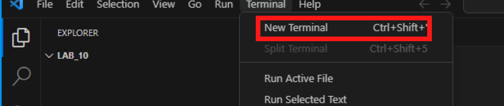

4. We are now ready to install our dependencies. Remember, we are using the package manager npm to install manage dependencies listed in `package.json` file (you can find this file in the root of your `lab_10` folder). We'll use the VS Code terminal to do this. Open the VS Code terminal and run the following command:

```bash
npm install
```

The above command installs the dependencies listed in the `package.json` file, and place them in the `node_modules` folder (it may take a little bit of time). For now, we have pulled in just three dependencies:

- `express`: A web framework for NodeJS.
- `ejs`: A templating engine for NodeJS.
- `nodemon`: A tool that will automatically restart our server when we make changes to our code.

You'll see in the `node_modules` folder that there are a lot of dependencies. These are the dependencies of the dependencies we have pulled in. This is one of the reasons why we use a package manager like npm. It makes it easy to manage all these dependencies.

5. We are now ready to run our application. If you check the `package.json` file, you'll I've created a start script: ` "start": "nodemon index.js",`. To run this script, in the terminal, run the following command: `npm run start`. This will start our server. You should see the following output:

```bash
   Example app listening at http://localhost:8000
```


6. Open a browser and navigate to `http://localhost:8000`. You should see our University of Discord web application. Currently, all of the values are hard-coded. We'll fix this in the next exercises.

## 0.3 Setting up the database

Let's set up the database we'll use for this lab.

1. Open the Laragon terminal.

1. In the Laragon terminal load the database by running the following commands (ensure, if you copy and past the commands, there are no spaces - it's a good idea to type them out):

   1. Navigate the the MySQL bin folder:
      1. `cd C:\laragon\bin\mysql\mysql-8.0.30-winx64\bin`
   2. Run the command below to run the database script:
      1. `mysql -u root -p < C:\code\lab_10\seeds\university.sql`
   3. You'll be prompted for a password, just press enter.
   4. To check the database has been created:
      1. From the terminal run: `mysql -u root -p`
      2. Again, you'll be prompted for a password, just press enter.
      3. You should now be in the MySQL shell. Run the following command to see the databases: `show databases;`
      4. You should see the `university_web` database listed. This is the database you created by running university.sql.

Phew! That was a lot of setup. But now we are ready to start adding some dynamic functionality.

## 1.0 Adding a database connection

In this section, we'll connect to our `university_web` database, this is a fairly simple process. We'll then use this connection to inject data into our views.

### Exercise 1.0: Adding a database connection

1. First, we need to install the Node.js, `mysql` package. This will allow us to connect to our database, and run queries. To do this, we'll use the VS Code terminal.

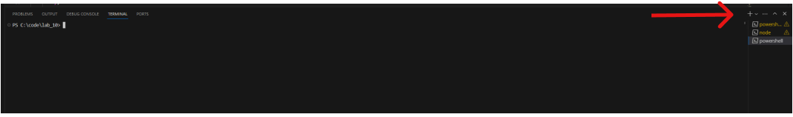

2. As your application is currently running in the terminal, create a new terminal tab in VS Code by clicking the `+` icon in the terminal pane.
3. In the VS code terminal, run the following command:

```bash
npm install mysql
```

4. Switch back to the terminal tab running your program. You'll need to check this regularly to see if you have any errors (hopefully you won't have any at the moment)

5. Now we need to add the code to connect to our database. Open the `index.js` file. At the top of the file, add the following code to import two dependencies :

```javascript
const util = require("util"); // import the util.
//This is a NodeJS package that contains a number of useful functions.
// We don't need to install this, it comes with NodeJS.
const mysql = require("mysql"); // import the mysql package we installed
```

3. Now we need to create a connection to our database. Add the following code below the const declarations.

You will see at the towards the top of your `index.js` file, there are some constants defined:

```javascript
const PORT = 8000;
const DB_HOST = "localhost";
const DB_USER = "root";
const DB_NAME = "university_web";
const DB_PASSWORD = "";
const DB_PORT = 3306;
```

The constants above are used to store database connection information. We can use these constants to create a connection to our database. Add the following code below the const declarations:

\break

```javascript
// set the connection parameters
var connection = mysql.createConnection({
  host: DB_HOST,
  user: DB_USER,
  password: DB_PASSWORD,
  database: DB_NAME,
  port: DB_PORT,
});

// we do this to use async await with mysql
connection.query = util.promisify(connection.query).bind(connection);

// connect to the database
connection.connect(function (err) {
  if (err) {
    console.error("error connecting: " + err.stack);
    return;
  }
  console.log("Booom! You are connected");
});
```

> > Connecting to the database.

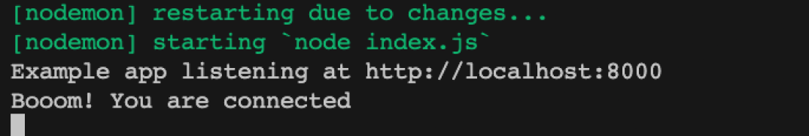

If all has worked correctly, you should see the following message in the terminal: `Booom! You are connected`. If you see an error, check the database name, username, and password are correct. If you are still having problems, ask for help.

**[Click here to see the solutions](https://github.com/joeappleton18/WEB-AND-DATABASE-SYSTEMS/tree/master/week-10/solutions/exercise_1_0)**

## 2.0 Injecting data into our views

In this section, we'll learn how to inject data into our EJS views. We'll start by considering our home page.

### Exercise 2.0: Injecting data into the home view

1. Navigate to `http://localhost:8000` in your browser. You should see the following page:

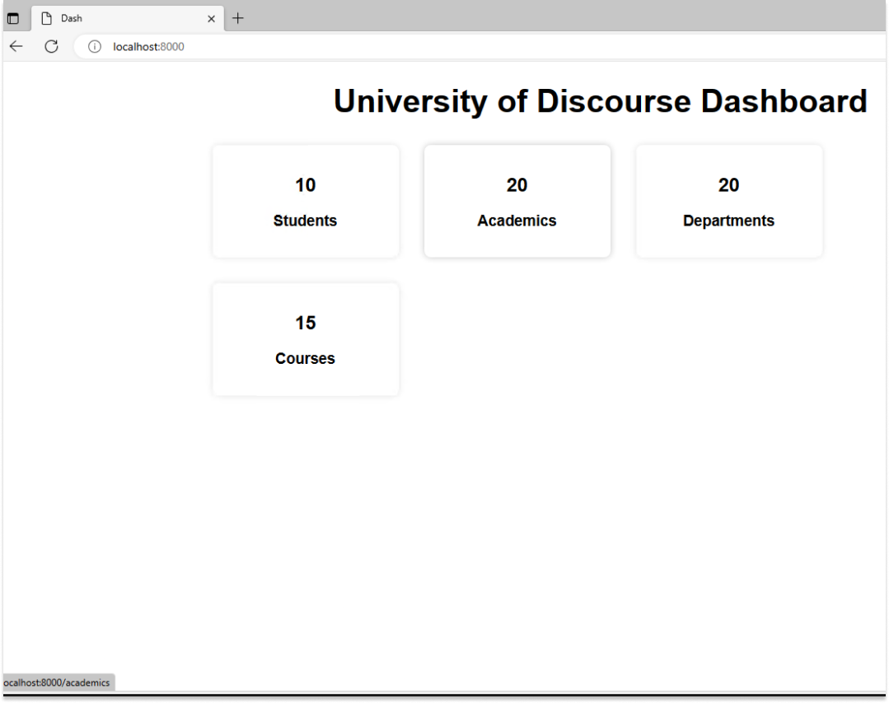

If you recall from last week, we use express to create routes. These routes are responsible for handling requests from the browser. In the `index.js` file, you should see the following code:

\break

```javascript
app.get("/", async (req, res) => {
  res.render("index", {
    studentCount: 10,
    academicCount: 20,
    departmentCount: 20,
    courseCount: 15,
  });
});
```

You should be familiar with the `app.get` syntax. However, notice how we are injecting data into the view. The curly braces `{}` are used to create an object. For now, just think of an object as a collection of key-value pairs and understand that we are hard-coding these values. Try changing some of the numbers and refreshing the page. You should see the values change on the home page.

We can access the values injected into our view by using the following syntax: `<%= studentCount %>`. The `<%=` and `%>` are special tags that tell EJS to inject the value of the variable into the view. To see this in action, open `views/index.ejs` and take a look at the code. You should see the following:

\break

```html
<div class="row">
  <div class="col-3">
    <div class="card">
      <div class="card-body">
        <h5 class="card-title">Students</h5>
        <p class="card-text"><%= studentCount %></p>
        <a href="/students" class="btn btn-primary">View</a>
      </div>
    </div>
  </div>
</div>
```

Now we know how to inject data into our views, we can start to make our application dynamic. Let's consider our university_web database. We have a number of tables:

\break

```bash

+--------------------------+
| Tables_in_university_web |
+--------------------------+
| Academic                 |
| Course                   |
| Department               |
| Postgraduate             |
| Student                  |
| Student_Email            |
| Undergraduate            |
+--------------------------+

```

Using a standard SQL query, we can get the number of rows in a table. For example, to get the number of students, we can run the following query:

```sql
SELECT COUNT(*) FROM Student; // this will return the number of rows in the Student table.
```

Since we are using the mysql package, we can run this query in our code, and save it to a constant like this:

```javascript
const studentCount = await connection.query(
  "SELECT COUNT(*) as count FROM Student"
);
```

1. Open the `index.js` file and add the following code in your `'/'` route (ensure you don't overwrite the existing code):

```javascript
...
app.get('/', async (req, res) => {
   // add this line
   const studentCount = await connection.query('SELECT COUNT(*) as count FROM Student');
	res.render('index', {
		studentCount: studentCount[0].count, // <--- update here
		academicCount: 20,
		departmentCount: 20,
		courseCount: 15
	});
});
...
```

> > index.js

Above, we run the query and store the result in a variable called `studentCount`. Notice how we use the `await` keyword. This is because the `connection.query` function is asynchronous. This means that it will take some time to run. We use the `await` keyword to tell NodeJS to wait until the query has finished running before continuing. StudentCount will be an array of objects. In this case, it will be an array with one object:

\break

```javascript
[
  {
    count: 10,
  },
];
```

We access the count value by using the following syntax: `studentCount[0].count`. The `[0]` is used to access the first element in the array. The `.count` is used to access the count property of the object.

3. To finish this task replace the remaining hard coded values (`academicCount`, `departmentCount`, and `courseCount`) with the output of SQL queries. When done, your homepage should look like this:

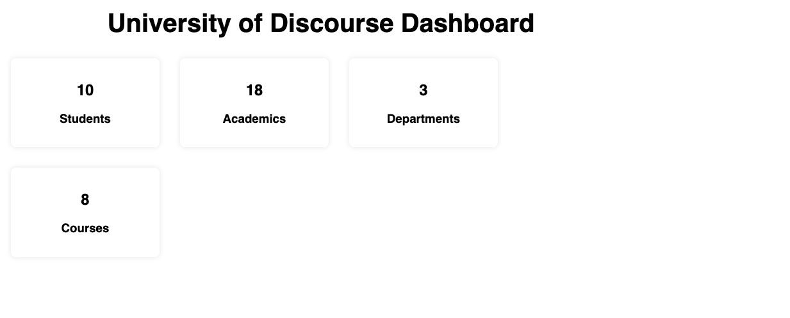

**[Click here to see the solutions](https://github.com/joeappleton18/WEB-AND-DATABASE-SYSTEMS/tree/master/week-10/solutions/exercise_2_0)**

## 3.0 Working with more complex data

So far, we have only injected simple, singular, values into our views. However, we can also inject more complex data. For example, we can inject an array of objects. Let's consider the `/students` route. You can fire this route by visiting `http://localhost:8000/students` in your VMs browser. You should see the following page:

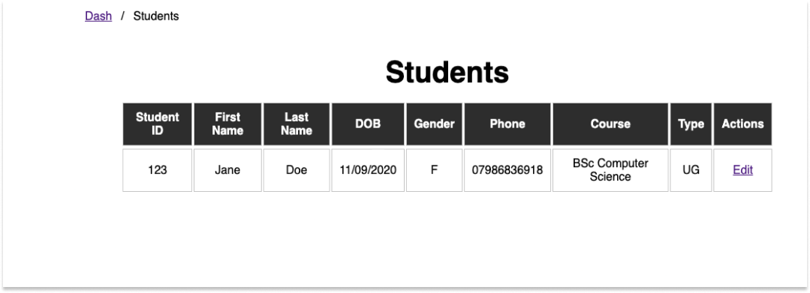

Currently, there is no dynamic data on this page. Take a look at `views/students.ejs`. You should see a bog standard html table. Let's see if we can make this view dynamic.

### Exercise 3.0: Dynamic multiple values

1. Open the `index.js` file. You should see the following code:

\break

```javascript
app.get("/students", async (req, res) => {
  res.render("students", { students: [] });
});
```

Above, we are rendering the `students` view and injecting an empty array into the view. We can access this array in the view by using the following syntax: `<%= students[0] %>` (this will grab our first student). Let's see if we can inject some data into this array. Update your code so instead of an empty array we are injecting database values:

```javascript
app.get("/students", async (req, res) => {
  const students = await connection.query(
    "SELECT * FROM Student INNER JOIN Course  ON student.Stu_Course = course.Crs_Code"
  );
  res.render("students", { students: students });
});
```

> > due to presenting the above code on a PDF, the select statement is split over two lines. In your code, it should be on one line.

Notice how we use an inner join. This is because we want to get the course name. If we did not have this we would just have to display the course code (this would not mean much to an end user).

Now we have injected the data into the view, we need to display it. Open the `views/students.ejs` file. The great thing about EJS is that we can use JavaScript in our views. This means we can use loops to iterate over our data. For example we can use the following code to iterate over our students array and out output a table row for each student:

```html
<% students.forEach(student=> { %>
<tr>
  <td><%- student.URN %></td>
  <td><%- student.Stu_FName %></td>
  <td><%- student.Stu_LName %></td>
  <td><%- student.Stu_DOB %></td>
  <td><%- student.Stu_Gender %></td>
  <td><%- student.Stu_Phone %></td>
  <td><%- student.Crs_Title %></td>
  <td><%- student.Stu_Type %></td>
  <td><a href="/students/edit/<%- student.URN %>"> Edit </a></td>
</tr>
<% }) %>
```

Notice how we use the `<% %>` tags to tell EJS that we are using JavaScript. We then use the `forEach` function to iterate over the students array. For each student, we output a table row. Further, we create a unique link to the edit page (`<a href="/students/edit/<%- student.URN %>"> Edit </a> </td>`) for for each student. We'll create this page in the next exercise. **Hint,** you could use the same technique to create a link to a view student page. In this lab, we are just going to focus on the edit page.

1. To complete this exercise, see if you can update `views/students.ejs` to dynamically display our students.

**[Click here to see the solutions](https://github.com/joeappleton18/WEB-AND-DATABASE-SYSTEMS/tree/master/week-10/solutions/exercise_3_0)**

## 4.0 Updating data

So far, we have only displayed data. However, we can also update data. Let's consider the `/students/edit` route. You can fire this route by visiting `http://localhost:8000/students/edit/1`. You should see the following page:

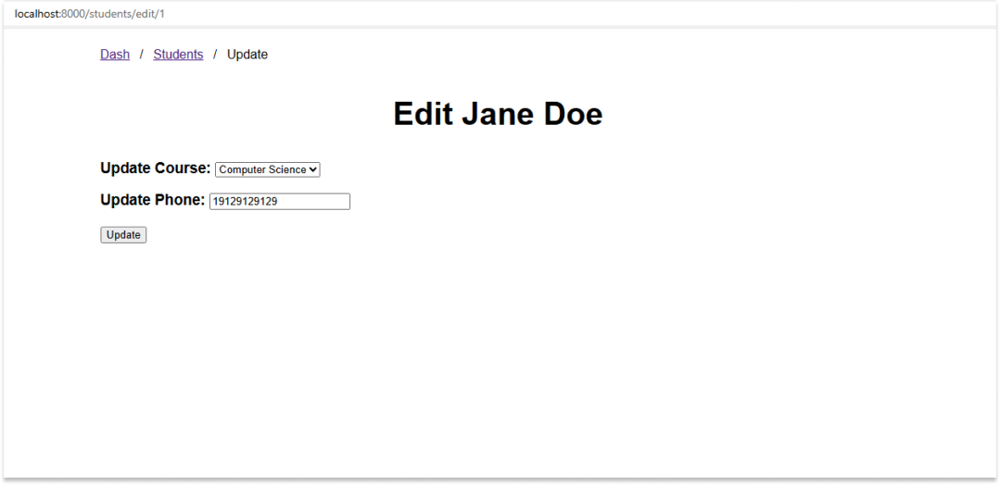

You've probably guessed, the values in this page are hard coded. Let's see if we can make this view dynamic. The first thing we need to consider is how we are going to get the data for the student we want to edit. We can do this by using a URL parameter. For example, if we visit `localhost:8000/students/edit/1`, we can get the value of the `URN` parameter (1 in this case) by using the following code:

```javascript
app.get("/students/edit/:id", async (req, res) => {
  const URN = req.params.id;
  res.render("student_edit", { student: {}, courses: [], message: "" });
});
```

Above we are using the `req.params.urn` syntax to get the value of the URN parameter. We can then use this value in our SQL query to get the student we want to edit:

\break

```javascript
app.get("/students/edit/:id", async (req, res) => {
  const student = await connection.query(
    "SELECT * FROM Student WHERE URN = ?",
    [req.params.id]
  );
  res.render("student_edit", {
    student: student[0],
    courses: [],
    message: "",
  });
});
```

Above, we are using the `?` syntax to tell MySQL that we want to use a parameterised query.
We then pass the value of the URN parameter as the second parameter of the `query` function. We then inject the student object into the view. We can then access the student object in the view by using the following syntax: `<%= student.<FieldName> %>`.

### Exercise 4.0: Accessing URL parameters

1. Use the above examples to update `index.js`'s `'/students/edit/:id'` route to inject the student object into the view.

2. To test your above update has worked. Navigate to `localhost:8000/students` and click edit on one of the student records. Next, update `views/student_edit.ejs` and replace "Jane Doe" with `<h1> Edit <%- student.Stu_FName %> <%- student.Stu_LName %> </h1>` and refresh the page. You should see the student's name appear on the page.

**[Click here to see the solutions](https://github.com/joeappleton18/WEB-AND-DATABASE-SYSTEMS/tree/master/week-10/solutions/exercise_4_0)**

### 4.1 Injecting values into a form

So far, we have been managing HTTP GET requests. Perhaps you've started to get a feel for how Express handles these requests through simple pattern matching. For instance, if I type "http://localhost:8000/students/edit/612345" into the browser and press enter, a get request is sent and matched with the route `app.get("/students/edit/:id"...)`. To this point, the communication has consisted of sending the data back to the browser (otherwise known as the client); however, to complete our application, we must enable the client to send user controlled data to the server.

The most common way for users to send data is through HTML forms - you probably already know this. Let's consider how we can update `views/student_edit.ejs` and `index.js` to process a form update.

### Exercise 4.1: Injecting values into a form

1. First, use the browser to navigate to the route: "http://localhost:8000/students/edit/612345"; you should see John Smith's record.
   Currently, the form has hard coded data! Let's consider how we can update this. In VS code, open `views/student_edit.ejs`.

2. Navigate to the `<form>` element there are two things we need to consider:

   1. The first is the `method` attribute in the form tag: `<form method="post" class="edit_form">` in this instance it is post. This tells the browser that we want to send a POST request to the server. We could add an optional, `action` attribute to the form tag. This tells the browser where to send the request. If we don't specify an action, the browser will send the request to the current route. In this case, it will send the request to `/students/edit/612345`, the current url.
   2. The second is how we embed values into the form. Consider the following: `<input type="tel" value="19129129129" name="Stu_Phone" required>`. There are some important things to note here:
      - The `value` attribute is used to set the value of the input. In this case, we are hard coding the value.
      - The `name` attribute is used to give the input a name. The name should match the name of the field in the database. In this case, we are using the `Stu_Phone` field.
      - The `required` attribute is used to tell the browser that the input is required. If the user tries to submit the form without filling in the input, the browser will display an error message.

3. Use the `<%= %>` syntax to inject a value from our view. For example, we could use the following code: `<input type="tel" value="<%= student.Stu_Phone %>" name="Stu_Phone" required>`. This would inject the student's phone number into the input.

Ok, so we've managed to inject the student's phone number into the form; however, we now need to consider the course they are taking this is a little more tricky. You'll notice the course the student is taking is a foreign key (e.g, 211). This key relates to the course code in the course table. Since we don't want to just display a course number to the user, we need to get the course name from the course table. You'll notice we are currently just passing in a blank array (`[]`) to the view.

\break

```javascript
app.get("/students/edit/:id", async (req, res) => {
  const student = await connection.query(
    "SELECT * FROM Student WHERE URN = ?",
    [req.params.id]
  );
  res.render("student_edit", { student: student[0], courses: [], message: "" });
});
```

4. Update the above section to pass in the courses. You'll need to use a SQL query to get the courses. You can use the following query as a starting point: `const courses = await connection.query('SELECT * FROM Course');`.

Now we have the courses in the view, we need to display them in the form. To do this we need to construct a loop to iterate over the courses array. For each course, we need to create an option tag. For example, we could use the following code:

```html

<% courses.forEach( course=> { %>
							<option value="<%= course.Crs_Code %>"
								<%=course.Crs_Code===student.Stu_Course ? 'selected'
								: "" %>>

								<%= course.Crs_Title %>
							</option>
<% }) %>
```

Notice how we use the `<%= %>` syntax to inject the course code and course title into the option tag. We also use a ternary operator (`<%=course.Crs_Code===student.Stu_Course ? 'selected'
								: "" %>`) to check if the course code matches the student's course code. If it does, we add the `selected` attribute to the option tag. This tells the browser to select the option.

5. Update the `views/student_edit.ejs` file to display the courses in the form. Once you've done this, the correct course should be selected when you visit the edit page for any student. **Note,** make sure you remove the currently hard coded courses.

**[Click here to see the solutions](https://github.com/joeappleton18/WEB-AND-DATABASE-SYSTEMS/tree/master/week-10/solutions/exercise_4_1)**

### 4.2: Processing a Post request

We are nearly there! We can now display the data in the form. The final step is to process the form when the user submits it.

### Exercise 4.2: Processing a Post request

1. First, we need to add a route to handle the post request. Open the `index.js` file and add the following code:

```javascript
app.post("/students/edit/:id", async (req, res) => {
  console.log(req);
});
```

> > `index.js`

2. Use the above example to update `index.js` to handle a post request from the form.
3. Submit the form (press the update button on the update page), and check the terminal. You'll see a long list of values; however, no `Stu_Phone` or `Stu_Course`! This is because we need to tell Express to parse are form values and attache them the HTTP request. To do this we first need to install the `body-parser` package.
4. In the terminal, run the following command:

```bash
npm install body-parser
```

5. Next, we need to tell Express to use the body-parser package. Open the `index.js` file and add the following code:

```javascript
// at the top of the file
const bodyParser = require('body-parser');

...
// below the other use statements
app.use(bodyParser.urlencoded({ extended: false }));

```

> > index.js

6. Now update your `post` route to print out the request body, and you should see the form values in the terminal when you submit the form:

```javascript
app.post("/students/edit/:id", async (req, res) => {
  console.log(req.body);
});
```

**[Click here to see the solutions](https://github.com/joeappleton18/WEB-AND-DATABASE-SYSTEMS/tree/master/week-10/solutions/exercise_4_2)**

### Exercise 4.3: Updating the database

We are now ready to update the database with the form values. The flow will look something like this:

1. The browser sends a POST request to the server.
2. The server parses the body of the request and gets the form values.
3. The server updates the database.
4. The server re-renders the edit page with the updated student.

Let's get going!

We can update the database, and re-render the edit view, by using the following code:

```javascript
app.post("/students/edit/:id", async (req, res) => {
  await connection.query("UPDATE Student SET ? WHERE URN = ?", [
    req.body,
    req.params.id,
  ]);
  const student = await connection.query(
    "SELECT * FROM Student WHERE URN = ?",
    [req.params.id]
  );
  const courses = await connection.query("SELECT * FROM Course");
  res.render("student_edit", {
    student: student[0],
    courses: courses,
    message: "student updated",
  });
});
```

> > `index.js`

Above we are using the `?` syntax to tell MySQL that we want to use a parameterised query. We then pass the value of the URN parameter (`req.params.id`) as the second parameter of the `query` function. Next, we gather the updated student and list of courses to populate our view. Finally, we re-render the view with a message to tell the user the student has been updated.

1. Use the code above to add the update functionality to your application. Once you've done this, you should be able to update the student's details and see the updated details on the edit page.

2. Finally, let's add some basic validation. We've already done this client side by adding the `required` attribute to the form inputs. However, it's normally a good idea to add some server-side validation. Let's consider how we might do this:

```javascript
app.post("/students/edit/:id", async (req, res) => {
  var message = "";

  if (isNaN(req.body.Stu_Phone) || req.body.Stu_Phone.length != 11) {
    message = "Please enter a valid phone number";
  } else {
    await connection.query("UPDATE Student SET ? WHERE URN = ?", [
      req.body,
      req.params.id,
    ]);
    message = "Student updated";
  }
  const student = await connection.query(
    "SELECT * FROM Student WHERE URN = ?",
    [req.params.id]
  );
  const courses = await connection.query("SELECT * FROM Course");
  res.render("student_edit", {
    student: student[0],
    courses: courses,
    message: message,
  });
});
```

> > `index.js`

Above, we are using the `isNaN` function to check if the phone number is a number. We are also checking the length of the phone number. If the phone number is not a number, or the length is not 11, we set the message to "Please enter a valid phone number". Notice how we are using the `||` if either of the conditions hold.

3. To finish the lab, add the above code to your application. Once you've done this, try updating a student's phone number to a non-number. You should see the message "Please enter a valid phone number" appear on the edit page.

**[Click here to see the solutions](https://github.com/joeappleton18/WEB-AND-DATABASE-SYSTEMS/tree/master/week-10/solutions/exercise_4_2)**

## Stretch Tasks

1. Add the ability to add a new student to the database. You'll need to create a new route, and a new view. You'll also need to add a link to the new student page on the students page. You can use the edit page as a starting point.
2. Can you add create, read, and update functionality for another table in the database (e.g., course, department, academic, etc.)?
3. Can you add delete functionality to the application? In the case of a student, this would mean adding a delete link next to the existing edit link. When the user clicks the delete link, the student should be deleted from the database.
