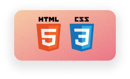

---
title: "HTML and CSS Pre-learning Notes"
author: [Joe Appleton]
date: "2023-10-17"
subject: "Practical Notes"
keywords: [Markdown, Example]
lang: "en"
toc: true
toc-own-page: false
...


# HTML and CSS Pre-learning Notes

<!-- Add a table of contents below  -->

<center></center>

Below are the key HTML and CSS concepts that we'll cover for the web part of web and database systems.

We won't be learning HTML and CSS in the lab sessions. Instead, I've provided a pre-learning video tutorial you should cover in your own time. The tutorial is a follow-along introduction to HTML and CSS. It covers all of the concepts listed below and should be sufficient to meet the learning outcomes of this module.

## HTML

HTML (Hypertext Markup Language) is the standard language for creating web pages. For beginners, it's important to understand the following key concepts:

1. **HTML Tags**: HTML is composed of a series of elements enclosed within angle brackets (< >). These elements are also known as tags. Tags are used to define the structure and content of a web page.
2. **HTML Document Structure**: An HTML document typically consists of two main sections: the `<head>` and the `<body>`. The `<head>`section contains metadata about the page (e.g., title, character encoding, linked stylesheets), while the `<body>` section contains the visible content of the page.
3. **Elements and Attributes**: HTML elements are defined by tags, such as `<p>` for paragraphs, `<a>` for links, and `` for images. Elements can have attributes that provide additional information or modify their behavior. For example, the `` tag has the src attribute to specify the image source.
4. **Text Content**: You can use tags like `<p>`, `<h1>`, `<h2>`, `<ul>`, and `<li>` to structure and format text content. Headings (`<h1>` to `<h6>`) represent hierarchical levels of importance.
5. **Links**: The `<a>` (anchor) tag is used to create hyperlinks. It uses the href attribute to specify the target URL. Links can point to other web pages, documents, or resources.
6. **Images**: Images are displayed using the `` tag. The src attribute specifies the image file, and the alt attribute provides alternative text for accessibility.
7. **Tables**: Tables are created using the `<table>`, `<tr>` (table row), `<th>` (table header), and `<td>` (table data) elements. They are used to organize data into rows and columns.
8. **Semantic HTML**: HTML5 introduced semantic elements like `<header>`, `<nav>`, `<section>`, `<article>`, `<footer>`, and `<aside>`. These elements add meaning to the structure of your document, making it more accessible and SEO-friendly.
9. **Forms**: HTML provides a range of form elements like `<input>`, `<textarea>`, `<select>`, and `<button>` for collecting user input.

## CSS

CSS (Cascading Style Sheets) is a fundamental technology for styling web pages. Here are some key considerations for beginners learning CSS:

1. **Selectors**: Selectors are used to target HTML elements that you want to style. The most common selector is the element selector (e.g., p for paragraphs), but you can also use class selectors (e.g., .my-class), ID selectors (e.g., #my-id), and more.
2. **Properties and Values**: CSS properties define what aspects of an element you want to style (e.g., color, font-size, background-color). Values are assigned to properties to specify how the styling should be applied (e.g., red, 16px, #FFFFFF).
3. **Rule Declarations**: CSS rules consist of selectors and rule declarations. A rule declaration is enclosed in curly braces {} and contains one or more property-value pairs. For example:

```css
p {
  color: blue;
  font-size: 16px;
}
```

4. **Cascading and Specificity**: CSS follows a cascading order, which means that styles can be inherited and overwritten.
5. **Box Model**: The box model describes how HTML elements are rendered as rectangular boxes with content, padding, borders, and margins. You can control the dimensions of these elements using properties like width, height, padding, margin, and border
6. **Display Property**: The display property defines how an element is rendered in the document flow. Common values include block, inline, inline-block, and none. Choosing the right value can significantly impact the layout and behavior of elements.
7. **Flexbox and Grid Layout**: CSS offers advanced layout techniques like Flexbox and Grid Layout for creating complex, responsive layouts with ease. These are powerful tools for arranging and aligning elements in a flexible way.
8. **Pseudo-Classes:** Pseudo-classes allow you to style elements based on their state or position, such as `:hover` for mouse hover, `:active` for active elements, and `:nth-child` to target elements based on their position within a parent element.

## Further Reading and Study

- [W3 Schools HTML](https://www.w3schools.com/html/default.asp) and [CSS Tutorial](https://www.w3schools.com/css/default.asp) : W3 Schools is a comprehensive guide for basic web development.

- [Mozilla](https://developer.mozilla.org/en-US/docs/Learn/HTML/Introduction_to_HTML): When you pass the absolute beginner stage, Mozilla should be your goto reference for Web Development.
