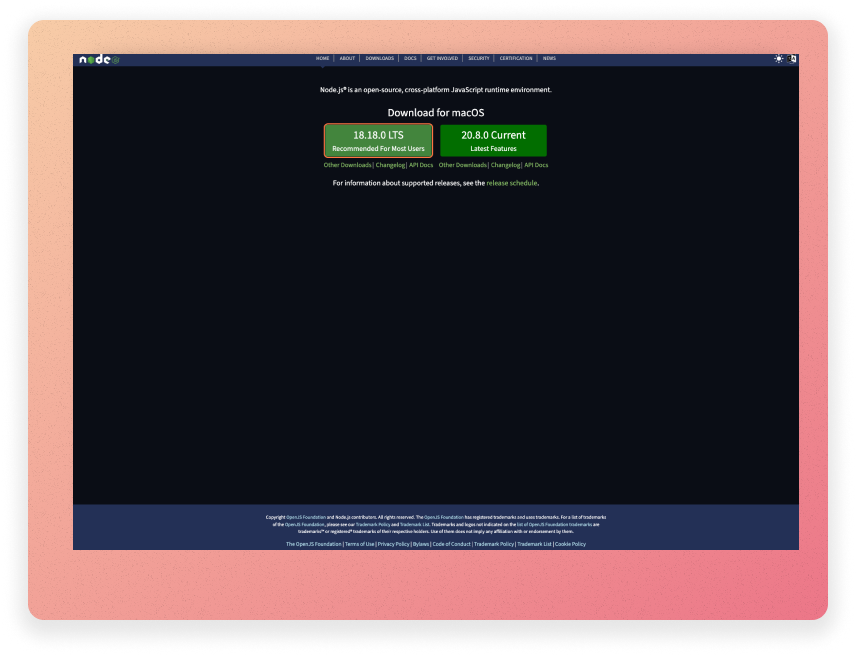

---
title: "Introduction to JavaScript: Lab Notes"
author: [Joe Appleton]
date: "17-10-2023"
subject: "Practical Notes"
keywords: [Markdown, Example]
lang: "en"
toc: true
toc-own-page: false
...

# Lab Notes: Introduction to JavaScript

I am incredibly excited to introduce JavaScript, my favourite programming language!

JavaScript is a versatile and widely-used programming language that powers the interactive elements of the web (e.g., YouTube, Twitter), desktop (e.g., VS Code, Discord) and mobile (Uber Eats, Walmart, Facebook Ads Manager) applications.

## Defining Some Terms

If you burrow into the surface of the JavaScript ecosystem, you'll hear the following terms used somewhat interchangeably: NodeJS, JavaScript, and TypeScript. So, let's start by considering each of these ideas:

**JavaScript**: JavaScript is a programming language primarily used for creating interactive and dynamic content within web browsers.

**Node.js**: Node.js is not a programming language but a runtime environment that allows you to run JavaScript code on the server. This is the environment we will be using for this module.

**TypeScript**: TypeScript is a statically typed superset of JavaScript developed by Microsoft. It allows developers to add optional static typing.

<!-- <<insert image here>> -->

For this module, we will be using Node.js to run server-side JavaScript. For now, you don't need to worry about TypeScript or JavaScript (used in the context of the browser).

## Running JavaScript in the NodeJS environment

To run JavaScript in the NodeJS environment, you should install NodeJS on your computer. This is a straight forward process.



1. Go to the official Node.js website at [https://nodejs.org](https://nodejs.org/).
2. Click on the "LTS" button to download the LTS version.
3. A PKG installer file should automatically start to download.
4. Once the installer is downloaded, locate the file (usually in your Downloads folder) and double-click it to run it.
5. Follow the installation instructions provided by the installer.
6. After the installation is complete, you should see a message indicating that Node.js and npm (Node Package Manager) have been successfully installed.
7. To ensure that Node.js was installed correctly, open a terminal window (e.g., PowerShell or Terminal on a Mac). Type in the following commands and press enter after each:
   1. `node -v` - This command will display the version of Node.js you installed.
   2. `npm -v` - This command will display the version of npm (Node Package Manager) that was installed.

### Making our first hello world program

Once you've installed NodeJS, you can now run JavaScript programs. Let's make the perennial "hello world" example. You'll need a text editor; I recommend using [VSCode](https://code.visualstudio.com/).

1. Open a text editor (such as Visual Studio Code, Sublime Text, Notepad, or any code editor of your choice) and create a new file. You can name it something like "hello.js" or "app.js.".

2. Inside your JavaScript file, add the following code:
   `console.log("Hello, World!");`

3. On your computer, open a terminal or command prompt. Use the cd (change directory) command to navigate to the directory where you saved your JavaScript file (if you are using VS code the inbuilt terminal will automatically open in the location of your file).

4. In the terminal or command prompt, use the node command followed by the name of your JavaScript file to run it. For example, if your file is named "hello.js," you would run: `node hello.js`. After running the command, you should see the "Hello, World!" message printed to the terminal or command prompt.

That's it! You've written your first NodeJS program. You can use the file created to run the code samples in these notes.

## Key JavaScript Concepts

For this module, we are keeping the web part extremely simple. As such, we only need to cover a handful of JavaScript concepts; however, this should be more than enough to achieve an excellent grade in the assessment.

### Comments

In javascript there are two ways to create comments

**Block Comments**

```javascript
/* This is a block comment, we can run 
		over multiple lines 
	*/
```

**Inline Comments**

```javascript
// This is a inline comment, it can only take up one line
```

### Variables

1. To create a variable, you use the var, let, or const keyword, followed by a name for the variable. For example:

- `var x;`
- `var x=5;`
- `var firstNumber,secondNumber,number1,number2,sum;`

2. Unlike Java, JavaScript is dynamically typed. This means you don't have to declare the type of variable in advanced. The value you assign to the variable determines the type.

```javascript
var myNumber = 42; // is a Number
var myString = "bar"; // is a string
var myBoolean = true; // is a boolean
```

### Mathematical Operators

You can apply mathematic operations to numbers using some basic operators like:

```JavaScript
 var x = 5;
 var y = 20;
 var result = x + y; // result will equal 25
 var result = x * y; // result will equal 100
 var result = y/x;  //  result will equal 5
```

## Control Flow

### If Statements

In order to code decisions into our javaScript programs it's necessary to use conditional statements know as `if` statements.

An `if` statement is a conditional statement which checks to see if a statement is `true` or `false` and then executes some additional statements depending on the result.

In javaScript a basic `if` statement looks as follows:

```javascript
if (condition) {
  //code to be executed if condition is true
}
```

**A real example**

```javascript
//check if the statement 5 > 3 is true and if so
//then print a suitable message
if (5 > 3) {
  console.log("It is bigger!");
}
```

We can also specify an alternative by using an `else` as follows:

```javascript
if (5 > 3) {
  console.log("It is bigger!");
} else {
  console.log("It is smaller");
}
```

The bigger than symbol `>` is know as a comparison operator. You may want to make use of the following operators:

| Operator | Description              |
| -------- | ------------------------ | --- |
| ==       | equal to                 |
| !=       | not equal                |
| >        | greater than             |
| <        | less than                |
| >=       | greater than or equal to |
| <=       | less than or equal to    |     |

### If Else If Statements

We can also chain together multiple `if` statements using `else if` as follows:

\break

```javascript
if (role == "Teacher") {
  console.log("You are a teacher!");
} else if (role == "Student") {
  console.log("You are a student!");
} else if (role == "Admin") {
  console.log("Your are an admin");
} else {
  console.log("I don't know what you are!");
}
```

In the above example you will notice that an else if statement is used
to specify alternative paths and that you can have more than 1 else if statement. In fact, you can have as many else if statements as you like.

## Multiple conditions

You can join together different conditions with "or” or “and” statements, to test whether either statement is true, or both are true, respectively.

In JavaScript “or” is written as `||` and “and” is written as `&&`.

Say you want to test if the value of x is between 10 and 20—you could do that with a condition stating:

```javascript
if (x > 10 && x < 20) {
  console.log("x is between 10 and 20");
}
```

If you want to make sure that country is either “England” or “Germany” you use:

```javascript
if (country == "England" || country == "Germany") {
  co nsole.log("You are in either England or Germany");
}
```

### Loops

Loops are a fundamental concept in computer programming. They allow us to repeat a set of one or more instructions a desired number of times.

Consider a simple javaScript program where we log "Surrey University" to the console 5 times. You may take the following approach in solving this problem:

```javascript
console.log("Surrey University");
console.log("Surrey University");
console.log("Surrey University");
console.log("Surrey University");
console.log("Surrey University");
```

The above approach works when we have to repeat an instruction a small number of times; however, as the number of times you have to repeat the same instruction increases, this approach becomes increasingly unfeasible. What if we now had to print Surrey University 1,000 times or even 1,000,000 times. In order to solve this problem we need to utilise loops.
The two main types of loops that we'll user are:

- **for loops** - used for a set number of iterations
- **while loop** - used when a certain condition is met

#### While Loops

A while loop is a control flow statement that allows code to be executed repeatedly based on a given Boolean condition. The while loop can be thought of as a repeating if statement.

The syntax for a while loop is as follows:

```javascript
while (condition) {
  //code to be executed if condition is true
}
```

> > syntax for a while loop

```javascript
var i = 0;
while (i < 5) {
  console.log("Solent University");
  i++;
}
```

> > example of a while loop

#### For Loops

For loops are used for a set number of iterations. The syntax for a for loop is as follows:

```javascript
for (initialization; condition; increment) {
  //code to be executed if condition is true
}
```

> > syntax for a for loop

```javascript
for (var i = 0; i < 5; i++) {
  console.log("Surrey University");
}
```

> > example of a for loop

## Functions

Functions in JavaScript are blocks of reusable code that perform a specific task or calculation. They are fundamental to the language and are used to encapsulate and organize your code.

You can declare a function using the function keyword, followed by the function name, parameters (if any), and the code to be executed inside curly braces {}.

```javascript
function sayHello() {
  console.log("Hello, world!");
}

sayHello(); // Calls the sayHello function
```

Functions can accept parameters, which are variables that act as placeholders for values passed when the function is called. For example:

```javascript
function greet(name) {
  console.log("Hello" + name);
}

greet("Alice"); // Calls greet with the argument "Alice"
```

Functions can return values using the return statement. When a function returns a value, you can use it in your code.

```js
function add(a, b) {
  return a + b;
}

const result = add(3, 4);
console.log(result); // Prints 7
```
