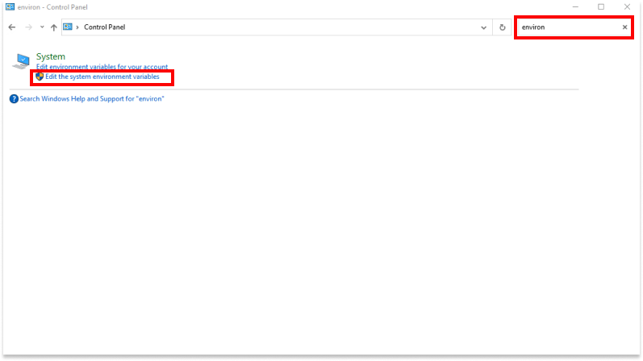
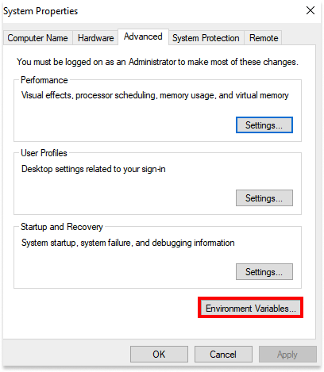
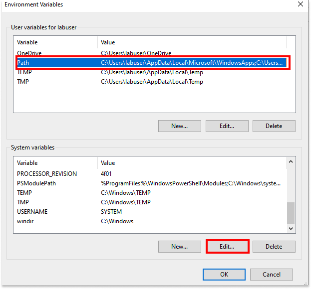
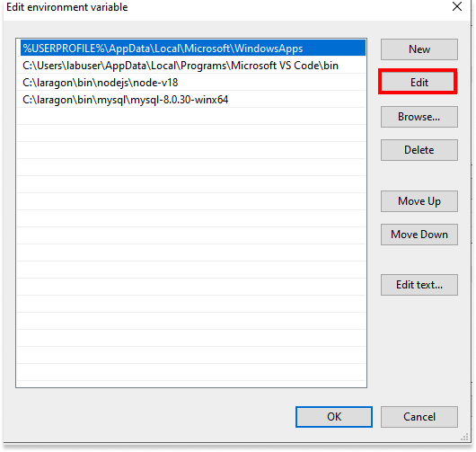

---
title: "Introduction to JavaScript: Lab"
author: [Joe Appleton]
date: "17-10-2023"
subject: "Lab"
keywords: [Lab]
lang: "en"
toc: true
toc-own-page: false
...

# Lab 8: Introduction to JavaScript

## Introduction

In this lab, you'll learn how to create `Node.js` applications. You'll learn how to run your programs from the terminal and how to use variables. Further, you'll learn how to control the flow of your program using conditional statements and loops. Finally, you'll learn how to create functions to make your programs more modular.

To complete the lab, work through the exercises below - please attempt them all. If you get stuck, ask your peers, student helper, or lecturer for help.

## 0. Getting Started

In this part of the lab, you'll set up your development environment.

### Exercise 0.0  : Loading the Virtual Machine

1. As always, start and connect to your Azure Labs' virtual machine (VM) by visiting this link: [https://labs.azure.com/virtualmachines](https://labs.azure.com/virtualmachines).
2. Connect to the VM:
   1. Toggle the button to start – it might take a while.
   2. Once it changes to Running, click on the monitor icon.
   3. A file will be downloaded – click on it to run it, and you will be prompted to enter the password you created last time. IMPORTANT: the username must be `labuser` (remove the ~/).
   4. Remember to click on the following icon to make the window resize appropriately 

### Exercise 0.1  : Leveling up our Development Environment

**Setting the Node.js Environment Variable**

For this part of the module we'll develop slightly larger programs. As such, we need to level up our VMs development environment.

**Let's start the exercise**

First, we will set up an environment variable to run `Node.js` from any terminal location. We are only doing this because we are using the Laragon Node.js package. [If you install node through the official way, the environment variable should set for you automatically](https://nodejs.org/en/download).

1. In the Window's search bar of your VM, search for and then select: System (Control Panel)



2. When the control panel is open stat typing "environment" into the search box at the top of the window, and click "Edit the system environment variables".



3. Click on the `Environment Variables button located the system properties window.



4. In the "Environment Variables Window": select "Path" the click "Edit".



5. In the "Edit environment variable window": click edit and add the following the value `C:\laragon\bin\nodejs\node-v18`. When added, you can click ok.

6. To check the installation, in the Window's search bar of your, search for and then select: "power shell". This should open a terminal session. Next type `node -v` into the terminal and press enter. You should see an output along the lines of `v18.8.0`.

Finally, we'll install a better text editor on VM, I recommend VS Code.

1. To install VS Code, open a browser and navigate to [https://code.visualstudio.com/](https://code.visualstudio.com/). Download the installer and run it. The default options should be fine.

## 1. Creating Node Applications

In this section you'll create your first `Node.js` application. You'll learn how to run your program from the terminal and how to use variables.

### Exercise 1.0 : Creating our first node application

Now we've leveled up our development environment we can make our first `Node.js` application.

**Let's start the exercise**

1. Within your VM, create a folder in your `C:\code` directory called `lab_8`.
1. If you haven't already, open VS Code on your computer.
1. In the menu at the top of VS Code, click on "file" -> "open folder". Open your lab_8 folder.
   You should now see the empty directory structure in the explorer bar of your VS code window. If you can't see the explore bar, press `CTRL+b`.
1. Right click on the explorer bar and create the file `exercise_1_0.js`.
1. Add the following code to the top of `exercise_1_0.js`:
   `console.log("hello world")`
1. Ensure `exercise_1_0.js` is saved.
1. To run the program open a new terminal session by clicking in the VS code menu `terminal -> new terminal`.
1. Type in to the terminal `node exercise_1_0.js` and press enter. Your program should output "hello world".
1. To stop your program from running, with the terminal in focus, press `Control + c`.

### Exercise 1.1  : Using Variables

We're going to expand on the first exercise and use variables. Pay close attention on how the `+` is used to concatenate(join together) text with variables.

**Let's start the exercise**

1.  Right click on the explorer bar and create the file `exercise_1_1.js`, and type in the below code:

```JavaScript
//set up our variables
var yourName;
var yourLocation;

// assign variable
yourName = "Joe";
yourLocation = "Brighton";

// output variable
console.log("your name is: " + yourName);
console.log("your location is: " + yourLocation);

```

2. From the terminal window, run your program: `node exercise_1_1.js`. You should see your name and location outputted.
3. Expand the above program to print out name and location in one `console.log statement`. The output should look like "Hello, Joe, you live in Brighton"

## 2. Further JavaScript

In this section you'll explore how you can control the flow of your program using conditional statements and loops. Further, we'll look at how to create functions to make our programs more modular.

### Exercise 2.0  : A NodeJS Guessing Game

In order to code decisions into our JavaScript programs it's necessary to use conditional statements know as `if` statements.

The aim of this exercise is to create a JavaScript guessing game. Your program will generate a number between a user defined range. The user will then make guesses with the aim of finding that number. Feedback will be given on if the guess is:

- Not a valid number!
- Smaller than the number!
- Larger than the number!
- An exact match!

**lets start the exercise**

1. Right click on the explorer bar and create the file `exercise_2_0.js`.
2. Add the following code to the top of `exercise_2_0.js`:

```JavaScript
const readline = require('node:readline/promises');
```

The above code imports the `readline` module and assigns it to the constant readline. This module allows us to read input from the terminal. We'll use this to get input from the user. The `require` keyword is used to import modules in Node.js.

2. We need a secret number for the player to guess. We'll generate a random number between 1 and 10. Add the following line of code to your program:

```JavaScript
const secretNumber = Math.floor(Math.random() * 10) + 1;
```

The above code uses the `Math` module to generate a random number between 1 and 10. The `Math.floor` function rounds down to the nearest integer. The `Math.random` function generates a random number between 0 and 1. We multiply this by 10 to get a number between 0 and 10. Finally, we add 1 to get a number between 1 and 10.

3. Next, we need to create an interface to get input from the user. Don't worry too much about the syntax of the below code. Add the following code to your program:

```JavaScript
const rl = readline.createInterface({
	input: process.stdin,
	output: process.stdout
});

```

The above code creates an interface to read input from the terminal. The `rl` variable is assigned to the interface. The `createInterface` function takes an object as an argument. The `input` property is set to `process.stdin` which is the standard input stream. The `output` property is set to `process.stdout` which is the standard output stream. Again, don't worry too much about this, we won't be reading inputs from the stdin again.

4. Next, we need to create a function to get input from the user. Next we need to create the main game play loop. Add the following code to your program:

\break

```JavaScript
async function guessNumber() {
  let guessCount = 0;
  while (guessCount < 5) {
    // Ask the user for a guess
   let answer = await rl.question('Guess a number between 1 and 10: ');
   // Convert the answer to a number
	let guess = parseInt(answer);
   // increment the guess count
   guessCount++;
   // at this point the user input is stored in guess and the guess count is stored in guessCount
   // your code goes here

  }

  console.log('Sorry, you ran out of guesses!', `The secret number was ${secretNumber}`);
  rl.close();

}

guessNumber();
```

5. As you go along, you should regularly run your program to check that it's working as expected. To run your program, open a vs terminal session and type `node exercise_2_0.js`. To exit your program, press `Control + c`. Give it a go now. You should be prompted to guess a number between 1 and 10, 5 times. After the 5th guess, the program should exit, and you should see the message "Sorry, you ran out of guesses! The secret number was **random number**".

   1. If your application is not running, check your code matches the code block in the appendix ([see appendix below: Part completed Exercise 2.0](#part-completed-exercise-20))

6. With in the while loop of your program can you add an if else statement to check if the user guess is correct. You should consider the following:

   1. The guess is smaller than the secret number, then run the following line of code: console.log("Too small!")
   2. The guess is larger than the secret number, then run the following line of code: console.log("Too large!")
   3. The guess is correct, then run the following lines of code:

   ```JavaScript
   console.log("Correct! You win!");
   rl.close()
   return;

   ```


<!--

// at this point the user input is stored in guess and the guess count is stored in guessCount
   // can you add an if else statement here to check if the guess is correct? You should consider the following conditions
   // 1. The guess is not a number, then run the following line of code: console.log("Not a valid number!")
   // 2. The guess is smaller than the secret number, then run the following line of code: console.log("Too small!")
   // 3. The guess is larger than the secret number, then run the following line of code: console.log("Too large!")
   /* 4. The guess is correct, then run the following lines of code:

   console.log("Correct! You win!");
   rl.close()
   return; */


>


The above task is quite challenging. If you get stuck, you can find the [solution by clicking here](https://github.com/joeappleton18/WEB-AND-DATABASE-SYSTEMS/blob/master/week-8/solutions/exercise_2_0.js).

### Stretch Task

Did you fly through the above exercises? If so, try the following, consider some of the following, **optional**, improvements:

1. Add a check to ensure the user enters a number between 1 and 10.
2. Add a check to ensure the user doesn't enter the same number twice.
3. Can you allow the user to choose the range of numbers to guess from?
4. Can you allow the user to choose the number of guesses they have?

## Solutions

You can find the solutions to the above exercises [by clicking here](https://github.com/joeappleton18/WEB-AND-DATABASE-SYSTEMS/blob/master/week-8/solutions/). Note, I don't provide solutions to the stretch tasks. If you've completed the stretch tasks, well done! You're doing great!

-->

## Appendix

\break

### Part completed exercise 2.0

```JavaScript

const readline = require('node:readline/promises');
const secretNumber = Math.floor(Math.random() * 10) + 1;

const rl = readline.createInterface({
  input: process.stdin,
  output: process.stdout
});


async function guessNumber() {
  let guessCount = 0;
  while (guessCount < 6) {
    // Ask the user for a guess
    let answer = await rl.question('Guess a number between 1 and 10: ');
    // Convert the answer to a number
    let guess = parseInt(answer);
    // increment the guess count
    guessCount++;

    // your code goes here

  }

  console.log('Sorry, you ran out of guesses!', `The secret number was ${secretNumber}`);
  rl.close();

}

guessNumber();


```
