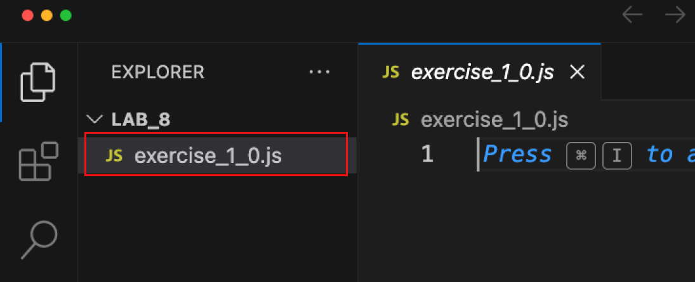
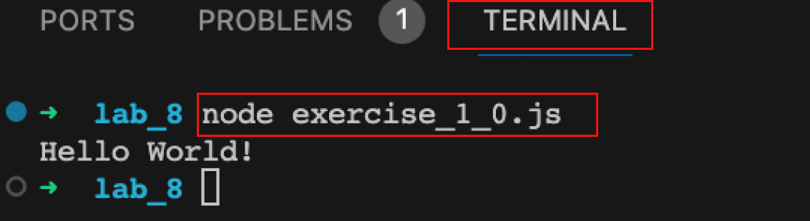

<!-- ---
title: "Introduction to JavaScript: Lab"
author: [Joe Appleton]
date: "17-10-2023"
subject: "Lab"
keywords: [Lab]
lang: "en"
toc: true
toc-own-page: false
... -->

# Lab 8: Introduction to JavaScript

## Introduction

In this lab, you'll learn how to create `Node.js` applications. You'll learn how to run your programs from the terminal and how to use variables. Further, you'll learn how to control the flow of your program using conditional statements and loops. Finally, you'll learn how to create functions to make your programs more modular.

To complete the lab, work through the exercises below - please attempt them all. If you get stuck, ask your peers, student helper, or lecturer for help.

You should also download the [lab notes](./lab-notes.pdf) to help you complete the lab.

## Lab Solutions

[The solutions to the lab can be found here](https://github.com/joeappleton18/WEB-AND-DATABASE-SYSTEMS/tree/master/week-8/solutions). You should, however, ensure that you attempt each exercise before you attempt the solutions.

## 0. Getting Started

In this part of the lab, you'll set up your development environment.

### Exercise 0.0 : Installing Node.js

In order to complete this lab, you'll need to install `Node.js` on the lab computer. `Node.js` is a JavaScript runtime that allows you to run JavaScript code outside of a web browser. [You can follow the instructions here to install node on either your own or the lab computer](https://surreylearn.surrey.ac.uk/d2l/le/lessons/267643/topics/3179365)

## 1. Creating Node Applications

In this section:

- you'll create your first `Node.js` application.
- you'll learn how to run your program from the terminal and how to use variables.

### Exercise 1.0 : Creating our first node application

Now we've leveled up our development environment; we can make our first `Node.js` application.

**Let's start the exercise**

<div class="alert alert-primary" role="alert">
 This exercise assumes you have `Node.js` installed on your computer. If you haven't installed `Node.js`, please refer to the steps in the previous exercise.

Further, if you haven't already, open VS Code on your computer. VS code is already installed on the lab computers. If you are using your own computer, you can download VS code [here](https://code.visualstudio.com/).

</div>

1. Create a folder in your called `lab_8`. It's worth creating this folder in something like a `WEB-AND-DATABASE-SYSTEMS` directory.
2. If you haven't already, open VS Code on your computer.
3. In the menu at the top of VS Code, click on "file" -> "open folder". Open your lab_8 folder.
   You should now see the empty directory structure in the explorer bar of your VS code window. If you can't see the explore bar, press `CTRL+b`.

4. Right click on the explorer bar and create the file `exercise_1_0.js`.



1. Add the following code to the top of `exercise_1_0.js`:
   `console.log("Hello World")`
2. Ensure `exercise_1_0.js` is saved.
3. To run the program open a new terminal session by clicking in the VS code menu `terminal -> new terminal`.
4. Type in to the terminal `node exercise_1_0.js` and press enter. Your program should output "hello world".



That's it! You've created your first `Node.js` application.

### Exercise 1.1: Using Variables

We're going to expand on the first exercise and use variables. Pay close attention on how the `+` is used to concatenate(join together) text with variables.

**Let's start the exercise**

1.  Right click on the explorer bar and create the file `exercise_1_1.js`, and type in the below code:

```JavaScript
//set up our variables
var yourName;
var yourLocation;

// assign variable
yourName = "Joe";
yourLocation = "Brighton";

// output variable
console.log("your name is: " + yourName);
console.log("your location is: " + yourLocation);

```

1. From the terminal window, run your program: `node exercise_1_1.js`. You should see your name and location outputted.
2. Expand the above program to print out name and location in one `console.log statement`. The output should look like "Hello, Joe, you live in Brighton"

## 2. Further JavaScript

In this section you'll explore how you can control the flow of your program using conditional statements and loops. Further, we'll look at how to create functions to make our programs more modular.

In this part of the lab, we'll be using `let` and `const` to declare variables, instead of `var`. `let` and `const` are newer ways of declaring variables. They are more flexible and less error prone than `var`. You can read more about the differences between `let`, `const` and `var` in an article written by freecodecamp ([click here](https://www.freecodecamp.org/news/var-let-and-const-whats-the-difference/)).

We'll also be exploring conditional statements and functions. You should refer to the lab notes for guidance on these topics ([click here](https://surreylearn.surrey.ac.uk/d2l/le/lessons/252843/topics/2870387)).

### Exercise 2.0 : A NodeJS Guessing Game

In order to code decisions into our JavaScript programs it's necessary to use conditional statements know as `if` statements.

The aim of this exercise is to create a JavaScript guessing game.

Your program will generate a random number between a user defined range. The user will then make guesses with the aim of finding that number. Feedback will be given on if the guess is:

- Not a valid number!
- Smaller than the number!
- Larger than the number!
- An exact match!

**lets start the exercise**

1. Right click on the explorer bar and create the file `exercise_2_0.js`.
2. Add the following code to the top of `exercise_2_0.js`:

```JavaScript
const readline = require('node:readline/promises');
```

The above code imports the `readline` module and assigns it to the constant readline. This module allows us to read input from the terminal. We'll use this to get input from the user. The `require` keyword is used to import modules in Node.js.

3. We need a secret number for the player to guess. We'll generate a random number between 1 and 10. Add the following line of code to your program:

```JavaScript
const secretNumber = Math.floor(Math.random() * 10) + 1;
```

The above code uses the `Math` module to generate a random number between 1 and 10. The `Math.floor` function rounds down to the nearest integer. The `Math.random` function generates a random number between 0 and 1. We multiply this by 10 to get a number between 0 and 10. Finally, we add 1 to get a number between 1 and 10.

4. Next, we need to create an interface to get a guess from the user. Don't worry too much about the syntax of the below code. Add the following code to your program:

```JavaScript
const rl = readline.createInterface({
	input: process.stdin,
	output: process.stdout
});

```

If you are interested, the above code creates an interface to read input from the terminal. The `rl` variable is assigned to the interface. The `createInterface` function takes an object as an argument. The `input` property is set to `process.stdin` which is the standard input stream. The `output` property is set to `process.stdout` which is the standard output stream. Again, don't worry too much about this, we won't be reading inputs from the stdin again.

5. Next, we need to create a function to get input from the user, allowing 5 guesses. Add the following code to your program:

```JavaScript
async function guessNumber() {
  let guessCount = 0;
  while (guessCount < 5) {
    // Ask the user for a guess
   let answer = await rl.question('Guess a number between 1 and 10: ');
   // Convert the answer to a number
	let guess = parseInt(answer);
   // increment the guess count
   guessCount++;
   // at this point the user input is stored in guess and the guess count is stored in guessCount
   // your code goes here - we'll add this in the next steps

  }

  console.log('Sorry, you ran out of guesses!', `The secret number was ${secretNumber}`);
  rl.close();

}

guessNumber();
```

6. As you go along, you should regularly run your program to check that it's working as expected. To run your program, open a VS code terminal session and type `node exercise_2_0.js`. To exit your program, press `Control + c`. Give it a go now. You should be prompted to guess a number between 1 and 10, 5 times. After the 5th guess, the program should exit, and you should see the message "Sorry, you ran out of guesses! The secret number was **random number**".

   1. If your application is not running, check your code matches the code block in the appendix ([see appendix below: Part completed Exercise 2.0](#part-completed-exercise-20))

7. With in the while loop of your program, can you add an if else statement to check if the user guess is correct. You should consider the following:

   1. The guess is smaller than the secret number, then run the following line of code: `console.log("Too small!")`
   2. The guess is larger than the secret number, then run the following line of code: `console.log("Too large!")`
   3. The guess is correct, then run the following lines of code:

   ```JavaScript
   console.log("Correct! You win!");
   rl.close()
   return;

   ```

The above task is quite challenging. If you get stuck:

- check the lab notes for guidance. These can be found [here](https://surreylearn.surrey.ac.uk/d2l/le/lessons/252843/topics/2870387).
- you can find the [solution by clicking here](https://github.com/joeappleton18/WEB-AND-DATABASE-SYSTEMS/blob/master/week-8/solutions/exercise_2_0.js).

### Stretch Task

Did you fly through the above exercises? If so, try the following, consider some of the following, **optional**, improvements:

1. Add a check to ensure the user enters a number between 1 and 10.
2. Add a check to ensure the user doesn't enter the same number twice.
3. Can you allow the user to choose the range of numbers to guess from?
4. Can you allow the user to choose the number of guesses they have?

## Solutions

You can find the solutions to the above exercises [by clicking here](https://github.com/joeappleton18/WEB-AND-DATABASE-SYSTEMS/blob/master/week-8/solutions/). Note, I don't provide solutions to the stretch tasks. If you've completed the stretch tasks, well done! You're doing great!

## Appendix

### Part completed exercise 2.0

```JavaScript

const readline = require('node:readline/promises');
const secretNumber = Math.floor(Math.random() * 10) + 1;

const rl = readline.createInterface({
  input: process.stdin,
  output: process.stdout
});


async function guessNumber() {
  let guessCount = 0;
  while (guessCount < 6) {
    // Ask the user for a guess
    let answer = await rl.question('Guess a number between 1 and 10: ');
    // Convert the answer to a number
    let guess = parseInt(answer);
    // increment the guess count
    guessCount++;

    // your code goes here

  }

  console.log('Sorry, you ran out of guesses!', `The secret number was ${secretNumber}`);
  rl.close();

}

guessNumber();


```
