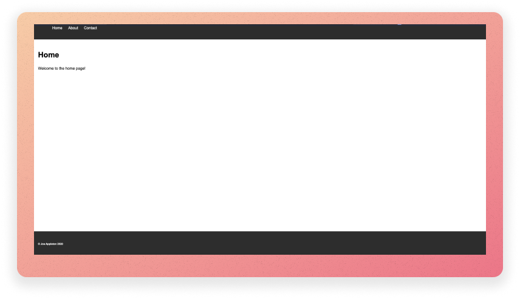
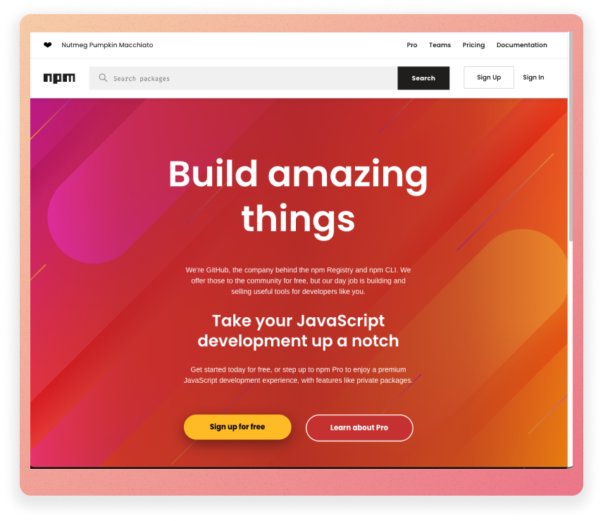
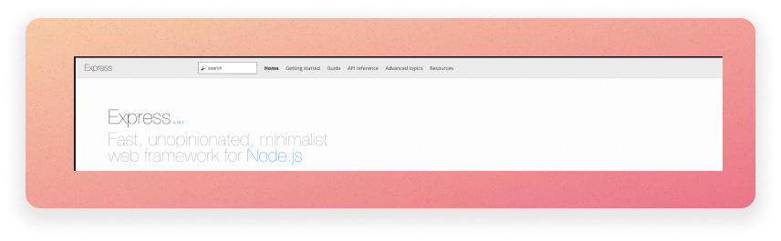
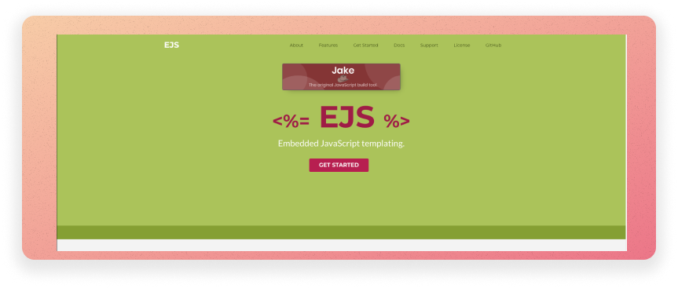

---
title: "Node.js and Express: Lab"
author: [Joe Appleton]
date: "25-10-2023"
subject: "Lab"
keywords: [Lab]
lang: "en"
toc: true
toc-own-page: false
colorlinks: true
listings-disable-line-numbers: true
header-includes:
  - |
    ```{=latex}
    \usepackage{awesomebox}
    ```
pandoc-latex-environment:
  noteblock: [note]
  tipblock: [tip]
  warningblock: [warning]
  cautionblock: [caution]
  importantblock: [important]
...

# Lab 9: Node.js and Express



> > This is what we'll be building.

In this lab, you'll construct a simple web application. You'll use the Express framework to create a web server, and you'll use `ejs` templates to create templated web pages.

## A Quick Recap

Last week, we created some simple JavaScript programs. We ran these programs in the Node.js environment. For instance, the following program prints "Hello World" to the console:

```javascript
console.log("Hello World");
```

> > example of a simple program called `hello_world.js`

We can run this program by typing `node hello_world.js` in the terminal.

## 0.0 Upping our Node.js Development Game

**Before you start this week's lab, ensure you have completed the week 8 task "Exercise 0.1 : Leveling up our Development Environment". This task will ensure that you have the correct software installed and configured on your virtual machine.**

### Package Management and the Package.json file



> > The NPM package manager website (https://www.npmjs.com/)

Node.js has a package manager called `npm` which comes bundled with your node installation. It is similar to Pip in Python or Maven in Java.

We can use `npm` to install packages that we can use in our programs.

One of the reasons I love JavaScript is it has a rich package ecosystem.

Think of packages as open-source, free bolt-ons to our programs.

At the time of writing, there are over 1.3 million packages. [You can explore packages by visiting the NPM repository](https://www.npmjs.com/package).

This week, we are going to use the packages (`express`, `ejs`, `chalkjs` and `nodemon`) to build a simple web application. We'll learn more about these packages, and how to include them in our projects, as we go along.

The above packages are simple to use; however, they are powerful. By the end of this session you will be able to complete the following assessment tasks:

- [ ] 8. Application Structure [3 Marks]
- [ ] 10. A Minimum of 4 User-facing Routes Served [4 marks]
- [ ] 11. Construct EJS Views for the 4 Routes [3 marks]

I don't teach maths; however, I think that's 10 marks. Or, nearly 30% of the marks for the web section of the assessment - not bad, hey?

### Exercise 0.1 : Getting Started

1. As always, start and connect to your Azure Labs' virtual machine (VM) by visiting this link: [https://labs.azure.com/virtualmachines](https://labs.azure.com/virtualmachines).
1. Connect to the VM:
   1. Toggle the button to start – it might take a while.
   2. Once it changes to Running, click on the monitor icon.
   3. A file will be downloaded – click on it to run it, and you will be prompted to enter the password you created last time. IMPORTANT: the username must be `labuser` (remove the ~/).
   4. Remember to click on the following icon to make the window resize appropriately 
1. Within your VM, create a folder in your `C:\code` directory called `lab_9`.
1. Open VS Code and open the `lab_9` folder.

### Exercise 0.2 : Creating a Package.json file

It all starts with a `package.json` file. This file contains information about your project and the packages that it depends on. It also contains a list of scripts that you can run. In this part of the lab, we are going to create a `package.json` file and install a package called `chalk`. `chalk` is a package that we can use to add colour to the text that we print to the console. We'll use it to make our terminal outputs a little more interesting.


> > The hello world program running in the VS Code terminal. Notice how it's green because we are using the `chalk` package.

To create a `package.json` file:

1. Open the terminal in VS Code. By default, your terminal will be pointing to the root of the `lab_9` folder. However, check this by typing `pwd` and pressing enter. If it is not pointing to the root of the `lab_9` folder, use the `cd` command to navigate to the root of the `lab_9` folder.
2. Type `npm init` and press enter. You'll see some prompts keep pressing enter to use the defaults.
3. You should now have a `package.json` file in your `lab_9` folder. This file contains information about your project and the packages that it depends on. It also contains a list of scripts that you can run. We'll look at this in more detail later.

### Exercise 0.3 : Installing Packages

<!-- insert image -->

We can now install the `chalk` package:

1. In the terminal ensure it is pointing to the root of the `lab_9` folder, type `npm install chalk@4` and press enter. This command installs the `chalk` package and saves it as a dependency in the `package.json` file.
2. If all has gone well, you should see that a `node_modules` folder has been created. This folder contains the `chalk` package and any other packages that it depends on. You should also see that the `package.json` file has been updated to include `chalk` in the list of dependencies. Finally, you should see a `package-lock.json` file has been created. **Note,** you never need to edit these files or directories. They are created and updated automatically by `npm`.
   1. You should not edit the contents of the `node_modules` folders; you can, however, delete it and run `npm install` to reinstall all of the packages that your project depends on. As such, there is **you should not commit this folder to your git repository or submit it as part of your assessment**.
3. We will now use chalk. In the `lab_9` folder, create a file called `exercise_0_3.js`. Add the following code to the file:

\break

```javascript
/**
 * Import the chalk package from the node modules_folder, notice how we don't need to use an absolute path.
 */
const chalk = require("chalk");
/**
 * Use the chalk package to print a blue message to the console.
 */
console.log(chalk.blue("Hello world!"));
```

1. In the terminal, type `node exercise_0_3.js` and press enter. You should see a blue message printed to the console. **Try and change the message to green!**

[If you got stuck: Click Here to See the Solution](https://github.com/joeappleton18/WEB-AND-DATABASE-SYSTEMS/blob/master/week-9/solutions/exercise_0_3_and_0_4/exercise_0_3.js)

### Exercise 0.4: Installing Nodemon

<!-- insert image -->

Nodemon is a package we can use to automatically restart our Node.js programs when we make changes to them. This is useful because it means we don't have to keep restarting manually.

To understand why we need to install Nodemon, let's create a more sophisticated Node.js program.

Up to this point, we've not really created any Node.js programs. We've just been running JavaScript files in the Node.js environment. The power of Node.js comes from the fact that we can use it to create web servers. This means we don't need to rely on a third-party web server such as Apache or Nginx.

Let's create a Web Server and try and understand why we need to install Nodemon.

1. Create a file called `exercise_0_4.js` in the `lab_9` folder. Add the following code to the file:

\break

```javascript
/**
 * Import the http package, this is a core Node.js package so it doesn't need to be installed.
 */
const http = require("http");
const server = http.createServer(); // Create a server object.
/**
 * Import the chalk package from the node modules folder; we installed this in the previous exercise.
 */
const chalk = require("chalk");
/**
 * Listen for requests and respond with a message. Notice how we are using a trusty arrow function (req,res) => and passing it into sever.on and the second argument.
 */
server.on("request", (req, res) => {
  res.end("hello world");
});

server.listen(8000, function () {
  /*
   * Print a message to the console when the server starts.
   */
  console.log(chalk.blue("Server is listening on port 8000"));
});
```

Do not worry if the code above seems somewhat alien to you; much of it may be new. In short, we are setting up web server listening on the localhost port 8000. When a client connects, we simply return hello world.

1. In the terminal, type `node exercise_0_4.js` and press enter. You should see a message printed, saying that the server is listening on port 8000. This means that the server is running and waiting for requests. If you open a web browser and navigate to `http://localhost:8000` you should see a message saying "hello world". Pat yourself on the back, you've just created a web server using Node.js!

2. Notice how, in the terminal, your program is still running. Make a change to your code, for instance update "hello world" to "Hello, World!". If you refresh or revisit `http://localhost:8000`, you will see that the change has not been applied. This is because the server is not restarting when we make changes to the code. We have to stop the server and restart it manually (press `ctrl + c` in the terminal and then type `node exercise_0_4.js` and press enter). This is a pain! We want the server to restart automatically when we make changes to the code.

This is where Nodemon comes in. Nodemon is a package that we can use to automatically restart our Node.js programs when we make changes to them.

1. To install Nodemon, stop the existing program from running: press `ctrl + c` in the terminal. Then type `npm install -D nodemon` and press enter. The `-D` flag tells `npm` to install the package as a development dependency. If you check the `package.json` file you should see that Nodemon has been added to the list of development dependencies. These types of dependencies are only required during development and are not required when the application is deployed to a production environment.

2. Next, we need to update the `package.json` file to tell it to use Nodemon to run our program. Open the `package.json` file and add the following line to the `scripts` section (there is already a `test` script in there; you only need to add the `start` script), make sure you add a comma after the `test` script, before you add the `start` script:

```json
 "scripts": {
    "test": "echo \"Error: no test specified\" && exit 1",
    "start": "nodemon exercise_0_4.js"
  },

```

> > The scripts section of the package.json file. Nodemon is installed in the `node_modules` directory. However, notice how we don't need to use an absolute path to reference it.

1. In the terminal make sure your application is not currently running, type `npm run start` and press enter. You should see a message printed to the console saying that the server is listening on port 8000. Now, if you make a change to the code and refresh the page, you should see that the change has been applied. This is because Nodemon is automatically restarting the server when we make changes to the code.

**tip**

Did you get a `Error: listen EADDRINUSE: address already in use :::8000` error. This means your application is still running from the previous step. Press `ctrl + c` in the terminal to stop it. Or, if all fails, use a different port number (e.g., 8001).

[If you got stuck: Click Here to See the Solution](https://github.com/joeappleton18/WEB-AND-DATABASE-SYSTEMS/blob/master/week-9/solutions/exercise_0_3_and_0_4/exercise_0_4.js)

## 1.0 Introduction to Express



> > The Express website (https://expressjs.com/)

Above, we created a simple web server using Node.js. To expand on this and create a more sophisticated web application we need to use a framework. A framework is a set of tools that we can use to build applications. We will use a framework called Express.

Express is a Node.js package that we can use to build web applications. It provides a set of tools that make it easier to handle requests and responses. Further, it handles concerns such as routing and middleware.

According to the the express documentation, "express is a minimal and flexible Node.js web application framework that provides a robust set of features for web and mobile applications". In other words, it provides a lightweight framework to assist in the development of web applications.

### Exercise 1.0 : Installing Express

From this point on, we are going to be building a simple web application. The entry point for this web application will be `index.js`. We will incrementally build up this application over the next few exercises.

1. In the VS Code terminal window, type `npm install express` and press enter.
2. Next, create the file `index.js`, this will be the entry point to our application.
3. Add the following code:

\break

```javascript
const express = require("express");
const app = express();
const port = 8000;

app.get("/", (req, res) => {
  res.send("Hello, World!");
});

app.listen(port, () => {
  /* 
    Print a message to the console when the server starts. Notice how we are using a template literal to insert the port number into the string. This is a new feature of JavaScript that allows us to insert variables into strings. We use the backtick character to denote a template literal. We then use the ${} syntax to insert the variable. 
  */
  console.log(`Example app listening at http://localhost:${port}`);
});
```

The above example uses the express package to create a new web-server that listens on port 8000 (l.9). We can then set up listeners to respond to any given HTTP request. Above, we listen for a get request to the base URL of our server (l.5).

1. Before we can run the application, we need to update the script tag in the package.json, so that it runs the index.js file. Open the `package.json` file and update the `scripts` section so that it looks like this:

```json
 "scripts": {
    "test": "echo \"Error: no test specified\" && exit 1",
    "start": "nodemon index.js"
  },
```

5. In the VS code terminal, type `npm run start` and press enter. You should see a message printed to the console saying that the server is listening on port 8000. If you open a web browser and navigate to `http://localhost:8000` you should see a message saying "Hello, World!". So far, we are not doing anything too exciting. However, we have created a web server using Node.js and Express.

   1. If your program is still running from the previous exercise, you will need to stop it by pressing `ctrl + c` in the terminal.

6. Add a new route to the application. For example, you could add the following code to the below the your existing route in `index.js`:

\break

```javascript
app.get("/about", (req, res) => {
  res.send("This is the about page");
});
```

1. To finish the exercise, create some further routes (e.g., `/contact`, `/about`).

[If you got stuck: Click here to see the solution](https://github.com/joeappleton18/WEB-AND-DATABASE-SYSTEMS/tree/master/week-9/solutions/exercise_1_0)

### Exercise 1.1 : Serving HTML files

Let's update the application so that it returns a HTML page instead of a plain text message. We are, after all, making web application.

Express makes serving static files easy. For instance, let's assume that we are making simple website. When we receive an HTTP get request to the root path `("/")` of our application we can return an index.html file (see the sample below):

\break

```javascript
const express = require("express");
/**
 * Import the path module, this is a core Node.js package so it doesn't need to be installed.
 */
const path = require("path");

const app = express();
const port = 8000;

app.get("/", (req, res) => {
  /**
   * serve the index.html file from the root of the project. Notice how we use the path module to resolve the path to the * file - this is imported at the top of the file. Using the path module is a good practice as it ensures that the path * is correct across different operating systems.
   */
  res.sendFile(path.resolve(__dirname, "index.html"));
});

app.listen(port, () => {
  console.log(`Example app listening at http://localhost:${port}`);
});
```

> > example of a simple express application that serves a HTML file. Make sure you have an index.html file in the root of your project. Further, make sure you have imported the path module at the top of your file!

```html
<!DOCTYPE html>
<html>
  <head>
    <title>My First Web Page</title>
  </head>
  <body>
    <h1>home page</h1>
  </body>
</html>
```

> > a simple html page called index.html. This needs to be in the root of your project. In this case, the `lab_9` folder.

1. Using the above example as a guide, within your `lab_9` folder set up and serve an html page, for each of the routes you created earlier (e.g., `/about` and `/contact`). For instance, when we visit `http://locahost:8000/about`; about.html should be served. You will need to create a HTML file for each route you created earlier (about, contact, and index). Place these files in the root of your project.

Currently, we cannot serve static assets such as CSS and images in our HTML pages. In order to configure this functionality we need to use some middleware.

Middleware can be considered functionality that runs between an HTTP request being received and a response being sent.

Express has a number of built-in middleware functions, and we can use them by calling `app.use()` and passing the middleware function as an argument.

Below is an example of how to use the `express.static()` middleware function, allowing us to serve static assets:

```javascript
const express = require("express");
const app = express();
const port = 8000;

/**
 *  Serve static files from the public folder
 */
app.use(express.static("public"));.

.... // the rest of your code

```

> > Above, express looks up the files relative to the static directory, so the name of the static directory is not part of the URL. For instance, if we place the image foo.jpeg in the public folder we would reference it in index.html like this, ``.

So, if we had the following:

```bash
|- lab_9
  |- index.js
  |- index.html
  |- public
    |- foo.jpeg
```

We could reference foo in our index.html page like this:

\break

```html
<!DOCTYPE html>
<html>
  <head>
    <title>My First Web Page</title>
  </head>
  <body>
    
    <h1>home page</h1>
  </body>
</html>
```

2. Can you find and insert a picture of [Rick Astley](https://www.peakpx.com/en/hd-wallpaper-desktop-katjp/download) or a cute cat into one of your HTML pages. Follow the above example to serve the image. You will need to create a public folder in the root of your project, and set up the static middleware.

Remember to place the image in the public folder, and you should be able to reference it in your HTML page using the `` tag. Remember to use the correct file extension (e.g., .jpeg, .png, .gif).

[Did you get stuck: Click here for the solution](https://github.com/joeappleton18/WEB-AND-DATABASE-SYSTEMS/tree/master/week-9/solutions/exercise_1_1)

## 2.0 EJS Templates



> > The EJS website (https://ejs.co/)

While serving plain HTML files provides us with a means to present a website, we do not have much flexibility and sophistication. For instance, how do we inject data into our html pages? Furthermore, how can we reuse sections of our HTML pages (e.g., the header and the footer)? Templating languages to the rescue!

In this module, we will explore one such language, Embedded JavaScript templating; otherwise know as EJS.

### Exercise 2.0 : Installing EJS

1. In the VS Code terminal window, type `npm install ejs` and press enter. You should be used to this by now!

Now you've installed EJS, yo can now tell express to render html pages using ejs. Below is a full example:

\break

```javascript
const express = require("express");
const path = require("path");
const app = express();
const port = 8000;
const ejs = require("ejs");

/**
 * we are telling express to use ejs as our view engine. This means that express will look for ejs files in the views folder.
 */
app.set("view engine", "ejs");

/**
 *  we are telling express to use the public folder to serve static files. This means that express will look for static files in the public folder.
 */
app.use(express.static("public"));

app.get("/", (req, res) => {
  res.render("index");
});

app.listen(port, () => {
  console.log(`Example app listening at http://localhost:${port}`);
});
```

In the above example, express will assume that we have an `index.ejs` file in a views folder, which lives in the root directory of your project.

EJS, is a superset of HTML. This means, to get the above example to work, we can simply rename our index.html file to `index.ejs` and move it to our views folder.

Using EJS, we now have some dynamic capabilities within our HTML views. The first thing you might want to do is extract a header into a shared folder such as `views/common/header.ejs` we could then share it amongst our pages as follows:

\break

```html
<!-- views/index.ejs -->
...
<body>
  <%- include('common/header'); %>
  <!-- notice how we emit the .ejs extension this will assume we have a file called header.ejs in the views/common -->
  <h1>Home Page</h1>
  
</body>
...
```

```html
<!-- views/common/header.ejs -->

<nav>
  <ul>
    <li><a href="/">Home</a></li>
    <li><a href="about"></a>About</li>
    <li><a href="contact">Contact</a></li>
  </ul>
</nav>
```

The project structure of the above example would look like this:

```bash

|- lab_9
  |- index.js
  |- public
    |- images
      |- test.jpeg
  |- views
    |- common
      |- header.ejs
    |- index.ejs
```

2. Using the above example as guidance, can you update your application to use EJS templates.
   1. You will need to create a views folder and move your HTML files into it, and change the extensions of the files to `.ejs`.
   2. Next, you will need to update your routes to render the correct EJS template. For instance, when we visit `http://locahost:8000/contact`, contact.ejs should be rendered.
   3. Finally, create a shared header and footer and include them in each of your pages. You will need to create a `views/common` folder and place your header and footer in it.

[If you got stuck: Click here for the solution](https://github.com/joeappleton18/WEB-AND-DATABASE-SYSTEMS/tree/master/week-9/solutions/exercise_2_0)

## Stretch Goal

Can you add some CSS and create some basic styles for your application (e.g., a background colour, a font, and some padding, make the links vertical). You will need to place your css file in the public folder you created. You will also need to update your HTML files to reference the CSS file. For instance, you could add the following line to the head of your HTML files:

```html
<link rel="stylesheet" href="style.css" />
```

If you are still a little unsure about css and html, then you should go over my pre-learning video and resources I've created: https://surreylearn.surrey.ac.uk/d2l/le/lessons/252843/topics/2881545
